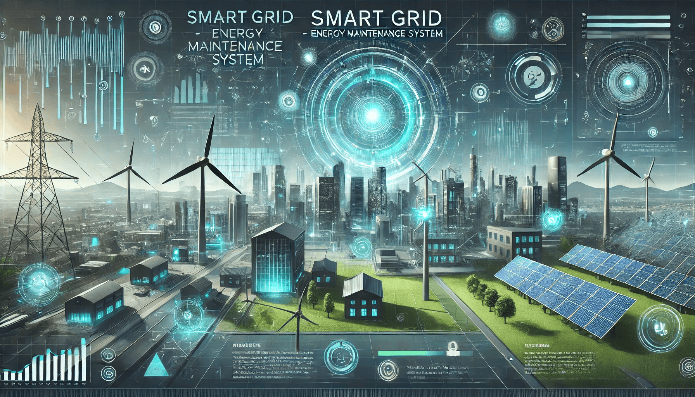

# SmartGrid Energy Management System (SGEMS)



## Introduction

The SmartGrid Energy Management System (SGEMS) is a comprehensive solution designed to forecast energy demand and optimize load balancing across smart grids. This project leverages advanced machine learning models and weather data integration to provide accurate energy consumption predictions, analyze weather impacts, balance energy loads, and offer eco-friendly recommendations. The project is implemented using Python and Streamlit, ensuring a user-friendly interface for data input, visualization, and analysis.

## Live Demo

Check out the live demo of the SmartGrid Energy Management System [here](https://smartgrid-ems.streamlit.app/).

## Key Features

- **Energy Demand Forecasting:** Use various forecasting models like Prophet, LSTM, and GRU to predict future energy consumption.
- **Weather Impact Analysis:** Understand how weather conditions affect energy consumption and simulate different scenarios.
- **Load Balancing:** Optimize energy distribution across the grid to enhance efficiency and stability.
- **Eco-Friendly Tips:** Get recommendations to reduce energy consumption and promote sustainable practices.
- **Voice-Activated Insights:** Interact with the system using voice commands to get quick insights and analyses.

## How to Use

1. **Upload Data:** Upload your historical energy consumption data in CSV format.
2. **Process Data:** Preprocess the data and integrate weather information.
3. **Generate Forecasts:** Choose a forecasting model and generate future energy demand predictions.
4. **Analyze Weather Impact:** Simulate temperature changes and analyze their impact on energy consumption.
5. **Optimize Load Balancing:** Calculate load distribution and optimize grid capacity.
6. **Get Recommendations:** Explore eco-friendly tips and voice-activated insights to enhance your energy management strategy.

To get started, navigate through the sidebar options and follow the instructions provided in each section.

## Explanation of Each File

### 1. `app.py`

This is the main application file that sets up the Streamlit interface, handles user inputs, and integrates the various components of the project. It configures the page, initializes session states, and provides navigation through different sections of the application.

### 2. `config.py`

This file contains configurations for the Weather API, model parameters, load balancing parameters, and data processing settings. It ensures that the necessary parameters and settings are defined and accessible throughout the project.

### 3. `requirements.txt`

This file lists the dependencies required for the project, including Streamlit, Pandas, NumPy, Plotly, Scikit-learn, TensorFlow, Prophet, and FPDF. It allows for easy installation of all necessary packages using pip.

### 4. `src/data_processor.py`

This file contains the `DataProcessor` class, which handles data validation, preprocessing, and feature creation. It ensures that the input data meets the required format and processes it to remove outliers, handle missing values, and add time-based features.

### 5. `src/data_generator.py`

This file contains the `generate_sample_data` function, which creates synthetic energy consumption data with temperature variations for testing and demonstration purposes. It generates a timestamp range, base consumption patterns, and temperature data.

### 6. `src/forecasting.py`

This file contains the `EnergyForecaster` class, which allows the use of different forecasting models, including Prophet, LSTM, and GRU, to predict energy consumption. It prepares data, trains models, generates forecasts, and evaluates model performance.

### 7. `src/advanced_models.py`

This file contains the `AdvancedForecaster` class, which implements LSTM and GRU models for time series prediction. It provides methods to create sequences, build models, train models, and generate predictions for more complex forecasting tasks.

### 8. `src/weather_api.py`

This file contains the `WeatherAPI` class, which integrates weather data into the energy consumption analysis. It fetches historical weather data based on the provided location and timestamp range.

### 9. `src/visualization.py`

This file contains the `DataVisualizer` class, which provides various methods to visualize energy consumption trends, forecast results, and load distribution. It creates line plots, heatmaps, and comparative analyses.

### 10. `src/recommendations.py`

This file contains the `EnergyRecommender` class, which offers tips and recommendations to reduce energy consumption and promote sustainable practices. It provides a list of eco-friendly tips.

### 11. `src/load_balancer.py`

This file contains the `LoadBalancer` class, which calculates optimal load distribution based on the forecasted energy demand and the grid's capacity. It identifies periods of high and low load and suggests redistribution to balance the load.

### 12. `src/pdf_report.py`

This file contains the `PDFReport` class, which generates PDF reports of the forecast results and load balancing analysis. It compiles the data into a readable format and allows for easy sharing and documentation.

### 13. `src/onboarding.py`

This file contains the `Onboarding` class, which provides a step-by-step tutorial to guide users through the application. It ensures that users understand how to use the different features and sections of the application.

## Testing the Project

An uploaded CSV file is provided for testing purposes. This allows you to test the upload data functionality and explore the features of the project using sample data.

## Installation

To install the necessary dependencies, run the following command:

```bash
pip install -r requirements.txt
```

## Running the Application

To run the Streamlit application, use the following command:

```bash
streamlit run app.py
```

## Conclusion

The SmartGrid Energy Management System (SGEMS) is a robust and user-friendly solution for forecasting energy demand, optimizing load balancing, and promoting sustainable energy practices. By leveraging advanced machine learning models and integrating weather data, SGEMS provides accurate forecasts and actionable insights to enhance energy management and reduce costs. The comprehensive pipeline ensures that users can easily upload data, generate forecasts, analyze weather impacts, balance loads, and access eco-friendly recommendations through an intuitive Streamlit interface.
